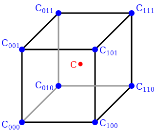

<h1> Linear Interpolation Class</h1>

**interpolationF** is a standalone interpolation function class that performs linear interpolation for given data, given on ordered grid. As an example, for a function of 2 variables, *f(x,y)=x+y*, data should be in form:
 x | y | f
--- | --- | ---
 1 | 1 | 2
 1 | 2 | 3
 2 | 1 | 3
 2 | 2 | 4

Entire class is templated for float, double and long double types.  
Constructors are overloaded so that they can take pointers to arrays or std::vectors as function arguments. Constructors are overloaded to take different number of inputs given the number of variables of a function.  
For one varible function constructors are given by:  
```
interpolationF(const T *xData, const T *fData, size_t NofElements)
interpolationF(const std::vector<T> &xData, const std::vector<T> &fData)
```
while for two varible function constructors are given by:  
```
interpolationF(const T *x1Data, const T *x2Data, const T *fData, size_t NofElements)
interpolationF(const std::vector<T> &x1Data, const std::vector<T> &x2Data, const std::vector<T> &fData)
```
where *xData, x1Data, x2Data* are function variable points, *fData* are function values and *NofElement* is the number of elements of the table.  
Constructors for three and four variable functions follow the same pattern. Four variable function is the highest number of variables this class can account for.

There is an additional constructors for two variable function:
```
interpolationF(const std::vector<T> &x1Data, const std::vector<T> &x2Data, const std::vector<std::vector<T>> &fData)
```
where variable vectors are grids and function values are given by 2D vector, meaning that *fData[i][j]* will corespond to *x1Data[i]* and *x2Data[j]*.  

There is also *setData* function which can be used as "constructor" if class object needs to be defined before the variables and function values are set - for example in a different function. Example usage for double data type would be:
```
void loadFunction(interpolationF<double> &intFunction) {
     // prepare x and f data
     intFunction.setData(x, f);
}

int main() {
     interpolationF<double> intFunction;
     loadFunction(intFunction);
}
```

All data is copied inside private class variables, so there is no need to save it after constructing class object.  

For acctual interpolation there is *interpolation* class method that takes values in which the function shoud be interpolated and returns interpolated value. Example usage for one variable function with float data type that is interpolated in 2.5 would be:
```
// prepare x and f data
interpolationF<float> intFunction(x, f);
auto interpolatedValue = intFunction.interpolation(2.5f);
```
*interpolation* class method is overloaded to take one, two, three or four inputs, based on the number of variables the interpolated function has and returns template type. Number of variables is set when constructing class object, or calling *setData* class method, and when interpolating, check is performed to confirm that number of inputs for *interpolation* class method is the same as number of variables. If these are not same error is printed to stderr and NaN is returned.  
Additiona check is perfomered to confirm that *interpolation* inputs are within the domain of the function, and since extrapolation is not implemented, error is printed to stderr and NaN is returned.  

There are additional domain and codomain class methods that return domain of interpolated function as 2D std::vector and 1D std::vector respectively. Domain method returns a 2D std::vector even is the function is has one varible in which case the dimensions of domain vector would be (1, 2).
