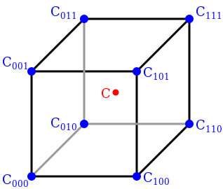

<h1> Linear Interpolation Class</h1>

**LinearInterpolator** is a high-performance, single-header C++ library for linear interpolation on ordered grids. It is designed for speed-critical applications (such as physics simulations) and supports up to 4D interpolation.

## Features
* **Single-Header**: Just `#include "linearinterpolator.hpp"` and you are ready to go.
* **Performance Optimized**: Internal logic is branchless-friendly, uses precomputed boundaries, and supports compiler vectorization.
* **Hybrid Error Handling**: Fast "clipping" behavior by default for production; detailed diagnostic reports and dimension checking when strict mode is enabled.
* **Fully Templated**: Supports `float`, `double`, and `long double`.

## Data Format

The library supports two ways of defining the grid:

1. **Implicit (Cartesian Product) Grid**: Provide only the unique coordinates for each axis. The library assumes a regular, repeating grid.
     - 2-variable function ($f\left(x,y\right)=x+y$) example:
          
          $x=\{1, 2\},$

          $y=\{1, 2\},$
          
          $f=\{2, 3, 3, 4\}$
2. **Explicit Flattened Vectors**: Provide the full coordinate for every data point.
     - 2-variable function ($f\left(x,y\right)=x+y$) example:
          
          $x=\{1, 1, 2, 2\},$
          
          $y=\{1, 2, 1, 2\},$
          
          $f=\{2, 3, 3, 4\}$

## Usage

### Initialization

The `LinearInterpolator` uses `std::vector` for data input and includes an optional name parameter. While optional, providing a name is **highly recommended** for debugging, as it will be printed in error messages to identify which specific object triggered an issue.

### 1. Standard Initialization

Use the constructor directly when your data vectors are already prepared in the same scope.

```c++
// 1D Example: f(x)
std::vector<double> energy = {1.0, 2.0, 3.0};
std::vector<double> dEdx = {0.15, 0.12, 0.10};

// Constructor: (axis_vectors..., data_vector, "OptionalName")
LinearInterpolator<double> stopPower(energy, dEdx, "StopPower");

// Perform interpolation
double loss = stopPower.interpolation(2.5);
```

### 2. Deferred Initialization (Loading from File)

In many simulations, data is loaded via a dedicated parser. You can define the object first and populate it later using `setData`.

```c++
#include "linearinterpolator.hpp"
#include <vector>

// Function to simulate loading data from a file
void loadFluxData(LinearInterpolator<double>& fluxInterpolator) {
    std::vector<double> energy, angle, temp, density, flux;
    // ... logic to read data from a file into vectors ...
    
    // Populate the interpolator and assign a name for debugging
    fluxInterpolator.setData(energy, angle, temp, density, flux, "PhotonFlux4D");
}

int main() {
    // Default constructor
    LinearInterpolator<double> flux;
    
    // Load data in a different function
    loadFluxData(flux);
    
    // Ready for use in the simulation loop
    double val = flux.interpolation(12.5, 0.8);
    return 0;
}
```

## Performance vs. Safety Modes

The `LinearInterpolator` is designed to be "fast by default." Boundary behavior is controlled via the `FAST_SIM_STRICT` compilation flag.

### 1. Fast Mode (Default)
In the default state, no "sanity" checks are performed.

- **Behavior**: If an input is outside the grid range, the interpolator clamps the value to the nearest edge. It does not check if the number of arguments matches the dimensions, assuming the caller is correct to avoid branching overhead.

- **Benefit**: Maximum throughput and vectorization. The compiler can optimize the clipping into branchless CPU instructions.

- **Compilation flag(s)**: `-O3 -march=native`

### 2. Strict Boundary Mode
To detect if a simulation is drifting outside the valid data domain or if dimensionality is mismatched, enable strict checking.

- **Behavior**: The library verifies that the number of arguments matches the table dimensions and checks if inputs are within range. It prints a detailed report to `stderr` (including the object name) and throws `std::invalid_argument` for dimension errors or `std::out_of_range` for extrapolation.

- **Usage**: Recommended for "pre-flight" sanity checks or debugging before long-running jobs.

- **Compilation flag(s)**: `-DFAST_SIM_STRICT`

## Technical Note
This class performs internal copies of all data. Once the object is constructed or `setData` is called, you may safely delete or modify your original data structures to save memory.